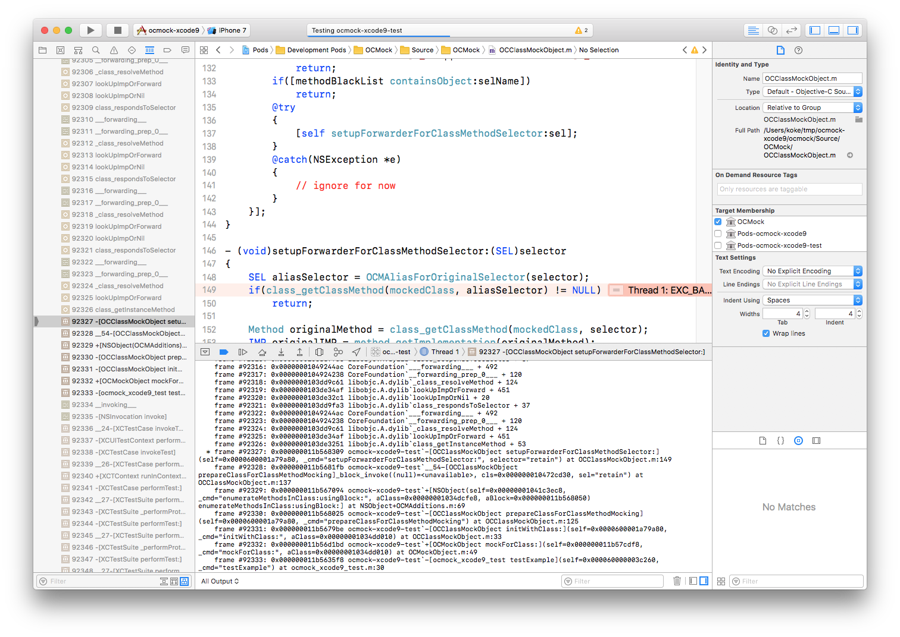

#  Instructions


```
git clone https://github.com/koke/ocmock-xcode9.git
cd ocmock-xcode9
git submodule update --init
pod install
```

Then open `ocmock-xcode9.xcworkspace` with Xcode 9, and run the test suite.



